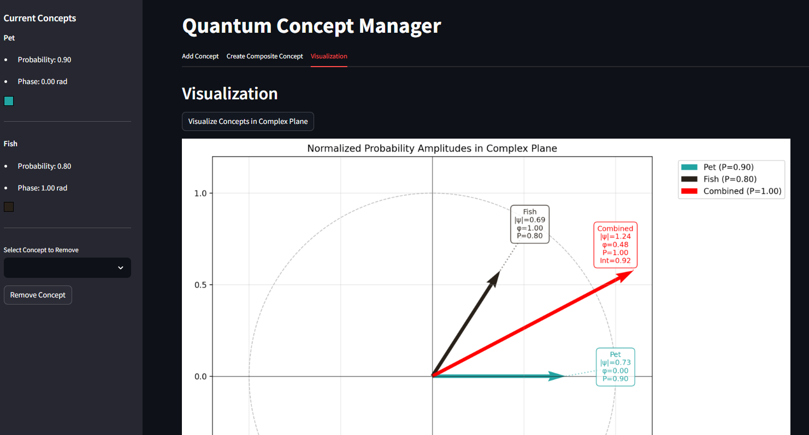

# Quantum-Inspired Categorization Model

A Streamlit app for exploring quantum probability concepts through interactive visualization. Model and visualize how concepts combine using quantum-inspired mathematics.



## Overview

This app helps visualize how concepts combine in non-classical ways using quantum probability principles. Users can create and combine concepts represented as complex probability amplitudes, observe interference effects, and see both individual and combined probabilities.

## Features

- Interactive interface with tabs for different operations
- Create concepts with custom magnitudes, phases, and colors
- Combine concepts with interference phase shifts
- Real-time visualization of probability amplitudes in the complex plane

## Dependencies

- streamlit
- numpy
- pandas
- matplotlib
- Python 3.7+

## Usage

Run the application:
```bash
streamlit run app.py
```

## Tabs:

1. **Add Concept**: Create individual concepts with magnitude, phase, and color
2. **Create Composite Concept**: Combine existing concepts with interference phases
3. **Visualization**: See concepts plotted in the complex plane

## Technical Details

The app uses quantum probability principles:

- Concepts are represented as complex probability amplitudes (ψ = r*e^(iθ))
- Individual probabilities follow Born's rule (P = |ψ|²)
- Combined probabilities include interference terms
- Visualization shows probability amplitudes in the complex plane

### Visualization Features

The complex plane visualization includes:
- Unit circle reference
- Normalized probability amplitude vectors
- Individual concept details:
  - Vector magnitude (|ψ|)
  - Phase angle (φ)
  - Individual probability (P)
- Combined state information:
  - Total amplitude
  - Combined probability
  - Interference term

## Implementation

The codebase includes three main classes:
- `Concept`: Base class for individual concepts
- `CompositeConcept`: Handles concept combinations with interference
- `ConceptManager`: Manages concept creation and relationships

Key functions:
- `calculate_combined_probability`: Determines total probability with interference
- `plot_complex_plane`: Creates the interactive visualization
